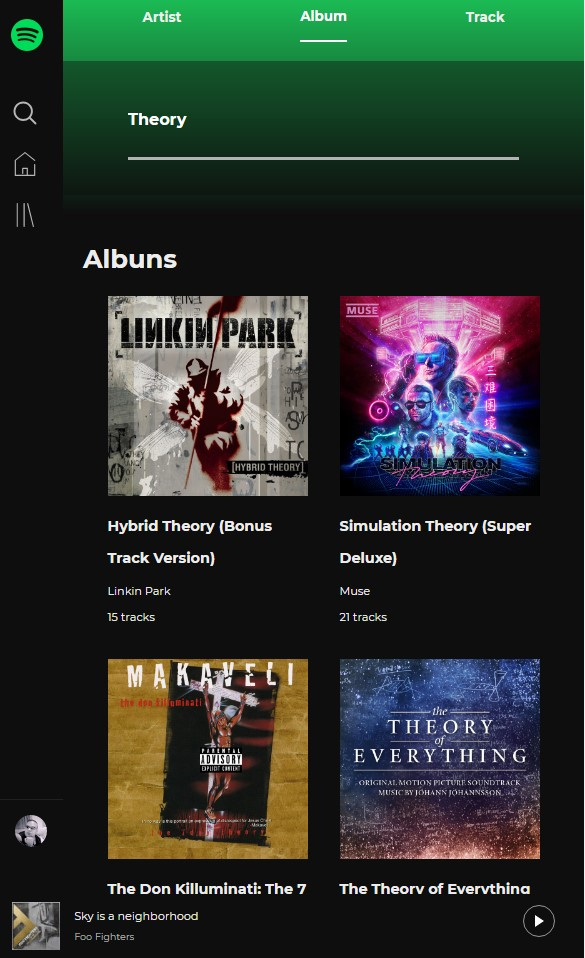
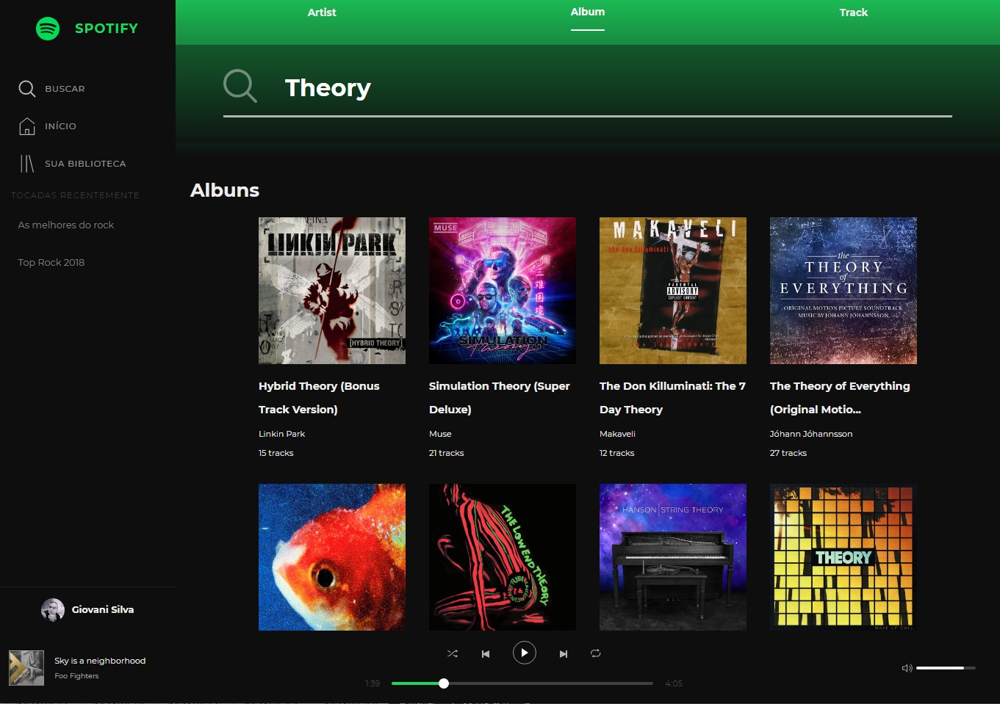
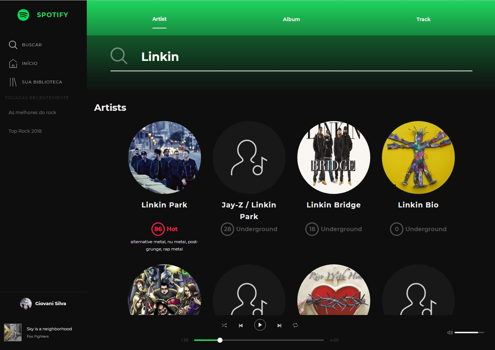

## SPOTIFY React

Create a web app based on Spotify's API to retrive data about **Artists**, **Albums** or **Tracks**.




Search for Albums


Search for Artist

`clone this repo`

Config CLIENT_ID in

```src/config/keys.js

const spotify = {
  CLIENT_ID: 'PUT CLIENT ID HERE',
  ...
}
```

Instal
`yarn`

Run
`yarn start`

[Spotify API reference](https://beta.developer.spotify.com/documentation/web-api/reference/search/search/)
